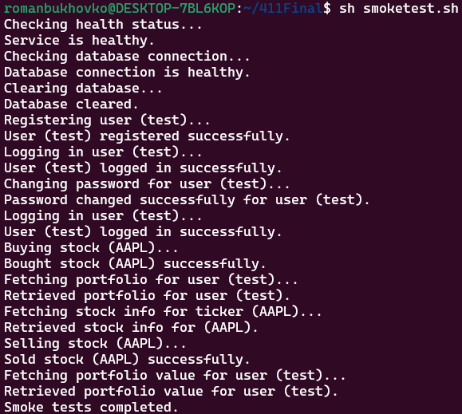

# Stock Trading Application

# Instructions On How To Run
1. Install dependencies
  `
    pip install -r requirements.txt
  `
2. Set up .env file 
3. Run run_docker script 
  `
    ./run_docker.sh
  `
4. Send requests to 'http://127.0.0.1:5000'

## Overview
### The Stock Trading Application is a straightforward and effective tool designed for individual investors who want to manage their portfolios, execute trades, and monitor market conditions.

### API: yfinance 

------------------------------------------------------------------------------------------------------------------------------------------------------------------------------

## Features
1. View My Portfolio

### Displays the user’s current stock holdings, including quantity, the current price of each stock, and the total value of each holding, culminating in an overall portfolio value.

2. "Buy" Stock

### Enables users to purchase shares of a specified stock. The user provides the stock symbol and the number of shares they wish to buy, and the transaction is executed based on the current market price.

3. "Sell" Stock

### Allows users to sell shares of a stock they currently hold. Users specify the stock symbol and the number of shares to sell, and the system processes the sale at the latest market price.

4. Look Up a Stock

### Provides detailed information about a specific stock, including its current market price, historical price data, and a brief description of the company. This feature is useful for conducting research before making buying or selling decisions.

5. Calculate My Portfolio Value

### Calculates the total value of the user's investment portfolio in real-time, reflecting the latest stock prices. This helps users understand the current worth of their investments.

------------------------------------------------------------------------------------------------------------------------------------------------------------------------------

# Routes

1. Route: /buy-stock
  - Request Type: POST
  - Purpose: Allows users to purchase shares of a specified stock.
  - Request Body:
    - username (String): The username of the buyer.
    - ticker (String): The stock symbol. 
    - quantity (Integer): The number of shares to buy.
  - Response Format: JSON
    - Success Response Example:
      ### Code: 200
    `{
      "status": "success",
      "message": "Stock added to portfolio"
    }`

  - Example Request:

    `{
      "username": "testuser",
      "ticker": "AAPL",
      "quantity": 10
    }`

  - Example Response:

    `{
      "status": "success",
      "message": "Stock added to portfolio"
    }`

2. Route: /sell-stock
  - Request Type: POST
  - Purpose: Allows users to sell shares of a stock they currently hold.
  - Request Body:
    - username (String): The username of the buyer.
    - ticker (String): The stock symbol. 
    - quantity (Integer): The number of shares to buy.
  - Response Format: JSON
    - Success Response Example:
      ### Code: 200
    `{
      "status": "success",
      "message": "Stock removed from portfolio"
    }`

  - Example Request:

    `{
      "username": "testuser",
      "ticker": "AAPL",
      "quantity": 5
    }`

  - Example Response:

    `{
      "status": "success",
      "message": "Stock removed from portfolio"
    }`

3. Route: /portfolio
  - Request Type: POST
  - Purpose: Retrieves the user's current stock holdings and the total portfolio value.
  - Request Body: 
    - username (String): The username of the user.
  - Response Format: JSON
    - Success Response Example:
      ### Code: 200
    `{
      "status": "success",
      "portfolio": {
        "AAPL": 10,
        "GOOGL": 5
      }
    }`

  -  Example Request:
    `{
      "username": "testuser"
    }`

  - Example Response:
      `{
        "status": "success",
        "portfolio": {
          "AAPL": 10,
          "GOOGL": 5
        }
      }`

4. Route: /stock-info
  - Request Type: POST
  - Purpose: Provides detailed information about a specific stock.
  - Request Body: 
    - ticker (String): The stock symbol. 
  - Response Format: JSON
    - Success Response Example:
      ### Code: 200
    `{
      "status": "success",
      "ticker": "AAPL",
      "last_prices": [150, 152, 148, 149, 151],
      "volumes": [1000000, 1200000, 1100000, 1050000, 1300000]
    }`

  - Example Request:

    `{
      "ticker": "AAPL"
    }`

  - Example Response:
    `{
      "status": "success",
      "ticker": "AAPL",
      "last_prices": [150, 152, 148, 149, 151],
      "volumes": [1000000, 1200000, 1100000, 1050000, 1300000]
    }`

5. Route: /portfolio-value
  - Request Type: POST
  - Purpose: Calculates the total value of the user's portfolio in real-time, reflecting the latest stock prices.
  - Request Body: 
    - username (String): The username of the user.
  - Response Format: JSON
    - Success Response Example:
      ### Code: 200
      `{
        "status": "success",
        "portfolio_value": 11500
      }`

  - Example Request:
    `{
      "username": "testuser"
    }`

  - Example Response:
    `{
      "status": "success",
      "portfolio_value": 11500
    }`

6. Route: /register
  - Request Type: POST
  - Purpose: Registers a new user by creating a new entry in the database.
  - Request Body: 
    - username (String): The username of the user.
    - password (String): The password of the user.
  - Response Format: JSON
    - Success Response Example:
      ### Code: 200
    `{
      "status": "User created"
    }`

  -  Example Request:
    `{
      "username": "testuser",
      "password": "testpassword"
    }`

  - Example Response:
    `{
      "status": "User created"
    }`

7. Route: /login
  - Request Type: POST
  - Purpose: Logs in a user by checking the username and password against the database.
  - Request Body: 
    - username (String): The username of the user.
    - password (String): The password of the user.
  - Response Format: JSON
    - Success Response Example:
      ### Code: 200
    `{
      "status": "Login successful"
    }`

  - Example Request:
    `{
      "username": "testuser",
      "password": "testpassword"
    }`

  - Example Response:
    `{
      "status": "Login successful"
    }`

8. Route: /change-password
  - Request Type: POST
  - Purpose: Allows users to change their password.
  - Request Body: 
    - username (String): The username of the user.
    - old_password (String): The current password of the user.
    - new_password (String): The new password of the user.
  - Response Format: JSON
    - Success Response Example:
      ### Code: 200
      `{
        "status": "Password changed",
      }`

  - Example Request:
    `{
      "username": "testuser",
      "old_password": "old_password",
      "new_password": "new_password"
    }`

  - Example Response:
    `{
        "status": "Password changed",
    }`

# Smoke Test Running

